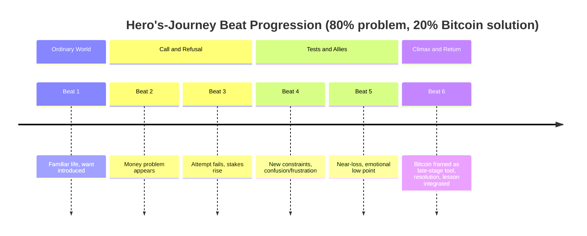

# Prompting an LLM to Build Montessori- and Science-of-Reading-Aligned Beat Sheets for Bitcoin-Themed Children’s Stories

## Executive summary

You want a beat/plot creator that outputs a **hero’s-journey beat sheet** as **strict JSON**, tailored to a child profile and a specific money lesson, while enforcing two “hard-mode” educational constraints:

- **Science of Reading / decodable constraints** for early readers: controlled vocabulary, repetition targets, and “taught words” introduced intentionally (so kids practice decoding rather than guessing). citeturn0search2turn2search11
- **Montessori alignment** for under-6: reality-based, practical-life-centered narratives that ground the child in the real world before “adult-imposed fantasy” becomes the main frame. citeturn1search0turn1search20

The pragmatic way to get reliability is **not one prompt** but a small pipeline: a **planner model** produces beats in strict JSON; then **validators** (deterministic + LLM critics) score Montessori + SoR + “anti–Mad Libs” quality, and a **rewrite model** fixes only the flagged issues. This maps cleanly onto provider-native structured outputs: entity["company","OpenAI","ai lab"]’s JSON Schema “Structured Outputs” with `strict: true` citeturn2search1turn0search4 and entity["company","Anthropic","ai company"]’s “Structured outputs” (JSON outputs) plus strict tool validation when needed. citeturn0search1turn2search10

## Core constraints that your beat planner must encode

### Science-of-Reading constraints as beat-level planning

At beat-sheet stage you’re not writing final page text yet, but you *can* plan decodability by making the planner output:

- **`decodability_tags`**: a compact plan for text difficulty (e.g., “CVC-heavy”, “HF-words-only”, “sentences<=6_words”, “repeat:key_phrase: ‘Save it’”).
- **`new_words_introduced[]`**: a deliberate introduction schedule for new decodable words and “taught words” (domain terms like “Bitcoin” that won’t be fully decodable for beginners). Decodable instruction emphasizes teaching kids to decode (letter–sound) rather than guess from pictures; decodable texts reinforce this habit. citeturn2search11turn0search2

For your validators, the most defensible “primary” references are entity["organization","Institute of Education Sciences","us education dept research"] and the entity["organization","What Works Clearinghouse","ies evidence review program"] practice guide on foundational reading (K–3), which centers explicit instruction in foundational skills and evidence-based implementation guidance. citeturn0search2turn0search6

### Montessori constraints as beat-level planning

Montessori guidance is often summarized as: **build a foundation in reality first** (especially under ~6), so the child’s imagination is “fed” by real experiences and facts rather than adult-authored fantasy worlds as the default. citeturn1search20turn1search0

Practically, for the beat planner this means:

- If age < 6: prefer **real settings** (home, grocery store, park, library, school, sports practice) and **practical life conflicts** (sharing, waiting turns, saving for something, prices changing).
- Avoid fantasy *as the engine* (dragons, spells, talking animals driving the plot). Pretend play can exist, but the story should still feel grounded and observational. citeturn1search0turn1search20
- If age is unspecified: mark it as **unspecified** (per your rule) and tag the beats conservatively (e.g., include `age_unspecified` in `decodability_tags` so downstream steps know to ask or select a safe default profile).

## Beat-sheet JSON schema and beat progression timeline

### Beat-sheet JSON Schema

Below is a schema that is intentionally “strict-friendly”: no optional fields, no extra top-level metadata, and no nullable types. This reduces failure modes when using strict JSON-schema outputs (especially in OpenAI’s `strict: true` mode). citeturn2search1turn0search4

```json
{
  "$schema": "https://json-schema.org/draft/2020-12/schema",
  "$id": "https://example.com/schemas/beat_sheet.schema.json",
  "title": "BeatSheet",
  "type": "object",
  "additionalProperties": false,
  "required": ["beats"],
  "properties": {
    "beats": {
      "type": "array",
      "minItems": 6,
      "maxItems": 14,
      "items": {
        "type": "object",
        "additionalProperties": false,
        "required": [
          "purpose",
          "conflict",
          "scene_location",
          "emotional_target",
          "page_index_estimate",
          "decodability_tags",
          "new_words_introduced",
          "bitcoin_relevance_score"
        ],
        "properties": {
          "purpose": { "type": "string", "minLength": 1 },
          "conflict": { "type": "string", "minLength": 1 },
          "scene_location": { "type": "string", "minLength": 1 },
          "emotional_target": { "type": "string", "minLength": 1 },
          "page_index_estimate": { "type": "integer", "minimum": 0, "maximum": 40 },
          "decodability_tags": {
            "type": "array",
            "minItems": 1,
            "maxItems": 12,
            "items": { "type": "string", "minLength": 1 }
          },
          "new_words_introduced": {
            "type": "array",
            "minItems": 0,
            "maxItems": 8,
            "items": { "type": "string", "minLength": 1 }
          },
          "bitcoin_relevance_score": {
            "type": "number",
            "minimum": 0,
            "maximum": 1
          }
        }
      }
    }
  }
}
```

### Mermaid beat progression timeline

This is a generic “hero’s journey” progression adapted to your required 80/20 Bitcoin split (problem discovery dominates, Bitcoin arrives mainly in the climax/resolution).



## Prompt templates for planner output and structured-output usage

This section gives you concrete prompt sets you can drop into either OpenAI “Structured Outputs” or Claude “Structured outputs.”

### Comparison of prompt variants

| Variant | What it optimizes | Main tradeoff |
|---|---|---|
| Short | Lowest tokens, fast, cheap | Higher “slot-fill” risk; more QC rewrites needed |
| Balanced | Good creativity + constraint adherence | Moderate token cost |
| Verbose | Max reliability and consistency | Costs more; may over-constrain creativity unless you explicitly ask for “freshness” |

### Planner system instructions (provider-agnostic, balanced)

Use as your system message. It is written to be compatible with strict JSON-schema output calling patterns.

```text
You are a beat-sheet planner for children's stories.

Your output MUST be valid JSON matching the provided JSON Schema exactly.
Do not include any keys other than those allowed by the schema.
Do not include markdown, comments, or explanations.

Inputs will include: child_first_name, pronouns, age_years (or "unspecified"), gender_pitch, interests[], money_lesson_key.
You must produce a hero’s-journey beat sheet.

Core constraints:
- Bitcoin split: approximately 80% of beats must illustrate the problem Bitcoin solves; approximately 20% should feature Bitcoin as the climax/resolution.
- Child is the hero and makes meaningful choices (not passive, not rescued by adults).
- Avoid "Mad Libs": do not merely swap nouns; make conflicts specific, emotionally believable, and tied to the child's interests and age.
- Montessori alignment: if age_years is under 6, keep the narrative reality-based and practical-life oriented. Avoid fantasy creatures, magic systems, and "adult-authored fantasy worlds" as the main engine.
- Science-of-Reading planning: encode decodable constraints using decodability_tags and new_words_introduced.
  - If age_years indicates early-reader range, keep tags strict (controlled vocabulary, repetition targets, taught words).
  - If age_years is "unspecified", add an "age_unspecified" tag and choose conservative, broadly suitable tags.

For each beat:
- purpose: the story function of the beat (setup, setback, test, etc.)
- conflict: a concrete problem with stakes a child would feel
- scene_location: grounded setting suited to the child profile
- emotional_target: the feeling the beat should evoke (curious, frustrated, proud, relieved, etc.)
- page_index_estimate: a rough page mapping (0-based)
- decodability_tags: concise planning tags (difficulty, repetition, taught words)
- new_words_introduced: 0–2 new words per beat for early readers; may be higher for older kids
- bitcoin_relevance_score: 0–1, where high values occur mainly in the final ~20% of beats
```

### OpenAI structured-output call template

OpenAI’s docs describe enforcing schema adherence via Structured Outputs with JSON Schema and `strict: true`. citeturn2search1turn0search4

```json
{
  "model": "YOUR_OPENAI_MODEL_THAT_SUPPORTS_STRUCTURED_OUTPUTS",
  "input": [
    {
      "role": "system",
      "content": "<<<SYSTEM INSTRUCTIONS FROM ABOVE>>>"
    },
    {
      "role": "user",
      "content": [
        {
          "type": "text",
          "text": "Create the beat sheet using this child profile and constraints:\n\nchild_first_name: Ava\npronouns: she/her\nage_years: 6\ngender_pitch: female\ninterests: [\"soccer\", \"puppies\"]\nmoney_lesson_key: inflation_metaphor\n\nRemember: ~80% problem beats, ~20% Bitcoin solution beats. Output strict JSON only."
        }
      ]
    }
  ],
  "response_format": {
    "type": "json_schema",
    "json_schema": {
      "name": "BeatSheet",
      "strict": true,
      "schema": { "<<<PASTE THE JSON SCHEMA HERE>>>": true }
    }
  }
}
```

### Claude structured-output call template

Claude provides native “Structured outputs” (JSON output) and separately supports strict tool schema validation. citeturn0search1turn2search10

```json
{
  "model": "YOUR_CLAUDE_MODEL_THAT_SUPPORTS_STRUCTURED_OUTPUTS",
  "system": "<<<SYSTEM INSTRUCTIONS FROM ABOVE>>>",
  "messages": [
    {
      "role": "user",
      "content": "Create the beat sheet using this child profile and constraints:\n\nchild_first_name: Leo\npronouns: he/him\nage_years: 5\ngender_pitch: male\ninterests: [\"dinosaurs\", \"drawing\"]\nmoney_lesson_key: delayed_gratification\n\nRemember: ~80% problem beats, ~20% Bitcoin solution beats. Output strict JSON only."
    }
  ],
  "output_format": {
    "type": "json_schema",
    "json_schema": {
      "name": "BeatSheet",
      "schema": { "<<<PASTE THE JSON SCHEMA HERE>>>": true }
    }
  }
}
```

### Few-shot example block you can embed (keep it short)

Keep few-shot tiny to avoid anchoring to “formula.” Use 1–2 shots max; rely on validators to enforce quality.

```text
Example (format only, do NOT copy plot):

Input:
child_first_name: Sam
pronouns: they/them
age_years: 7
gender_pitch: neutral
interests: ["space"]
money_lesson_key: saving

Output:
{"beats":[
  {"purpose":"Setup...","conflict":"...","scene_location":"...","emotional_target":"...","page_index_estimate":0,
   "decodability_tags":["..."],"new_words_introduced":["..."],"bitcoin_relevance_score":0.1}
]}
```

## Validators, deterministic checks, and rewrite instructions

### Deterministic checks (no LLM)

These should run before any LLM critic to save money.

- **Schema validation**: JSON schema validate; reject any extra keys.
- **Beat count**: `6 <= beats.length <= 14`.
- **Bitcoin 80/20 constraint** (approximate but enforceable):
  - Define “Bitcoin beats” as `bitcoin_relevance_score >= 0.65`.
  - Require `BitcoinBeats / TotalBeats` in `[0.15, 0.30]`.
  - Require all beats with `bitcoin_relevance_score >= 0.65` occur in the final 30% of `page_index_estimate` ordering.
- **Montessori trigger list (age < 6)**:
  - Fail if `conflict` or `scene_location` contains obvious fantasy terms (dragon, wizard, spell, enchanted kingdom, etc.).
- **SoR planning heuristics (early reader)**:
  - If `age_years` in `[5,7]` (or your chosen early-reader band), require each beat’s `new_words_introduced.length <= 2`.
  - Require `decodability_tags` include at least one of: `controlled_vocab`, `repetition`, or `taught_words`.
  - Require “taught words” like “Bitcoin” appear in `new_words_introduced` only in the last ~20% beats (to preserve your 80/20 narrative constraint).

### LLM critic prompt templates

Use cheap models. Critics should output strict JSON too (e.g., `{"pass":true,"issues":[...],"rewrite_instructions":"..."}`), but since you didn’t request a separate schema for critics, the templates below are “string-safe” and you can add your own schema later.

#### Montessori critic (LLM)

This aligns with AMI’s framing that young children need a foundation in real-world experiences; fantasy can exist but should not displace grounding experiences for under-6. citeturn1search20turn1search0

```text
Role: Montessori validator for children's narrative beats.

Given:
- child profile
- beat sheet JSON

Task:
1) If age_years < 6, check the beats are reality-based and practical-life oriented.
2) Flag adult-imposed fantasy framing (magic systems, fantasy creatures as main drivers).
3) Suggest minimal rewrites that preserve the child's agency and interests.

Output format (JSON only):
{
  "pass": boolean,
  "issues": [{"beat_index": number, "problem": string, "severity": "low|med|high", "fix": string}],
  "rewrite_instructions": string
}
```

#### Science-of-Reading planner critic (LLM)

Use this to check whether the beat plan *sets up* controlled vocabulary and repetition, consistent with decodable reading principles (decode rather than guess). citeturn2search11turn0search2

```text
Role: Science-of-Reading validator for early reader planning.

Given:
- child profile
- beat sheet JSON

Check:
- For early readers, new_words_introduced is small per beat and cumulative introduction makes sense.
- decodability_tags include controlled vocabulary and repetition planning.
- Taught words (e.g., "Bitcoin") are introduced intentionally and not too early.
- Beats avoid “picture-dependent comprehension” (no relying on illustrations to make the text make sense).

Output JSON only:
{
  "pass": boolean,
  "issues": [{"beat_index": number, "problem": string, "severity": "low|med|high", "fix": string}],
  "rewrite_instructions": string
}
```

#### Anti–Mad Libs / emotional-compulsion critic (LLM)

```text
Role: Narrative freshness critic for children's stories.

Given:
- child profile
- beat sheet JSON

Check:
- Each beat conflict is specific (not generic "something went wrong").
- Emotional targets progress (curiosity -> frustration -> determination -> relief/pride).
- The child makes at least 2 meaningful choices that affect the outcome.
- The setting uses the child's interests in a non-token way.
- Avoid preachy moral summary. Show the lesson through consequences and choices.

Output JSON only:
{
  "pass": boolean,
  "issues": [{"beat_index": number, "problem": string, "severity": "low|med|high", "fix": string}],
  "rewrite_instructions": string
}
```

### Rewrite instruction template (used when any validator fails)

This is the “surgical rewrite” pattern: preserve what’s good; modify only flagged beats; keep 80/20.

```text
You are rewriting a beat sheet to satisfy validator issues.

Rules:
- Output must match the same BeatSheet JSON Schema exactly.
- Preserve beats that were not flagged unless changes are necessary for global constraints.
- Apply the provided rewrite_instructions literally.
- Maintain ~80% problem beats and ~20% Bitcoin solution beats.
- Keep child as hero (agency and choices).

Inputs:
1) Original beat sheet JSON
2) Validator issues + rewrite_instructions

Now produce the revised beat sheet JSON only.
```

## Model routing and cost-control notes

### Routing recommendations

This is an “educated opinion” routing that tends to work well in practice:

- **Planner (beat sheet)**: choose a strong reasoning + creativity model that supports JSON schema output reliably. Both OpenAI Structured Outputs and Claude Structured Outputs are explicitly designed for this. citeturn2search1turn0search1
- **Critics (Montessori / SoR / narrative freshness)**: use cheaper, faster models; critics do short classification + targeted suggestions.
- **Rewrite model**: use either the same model as planner or the next tier down; keep it constrained (rewrite only flagged beats) to reduce tokens.

If you’re already committed to OpenAI/Claude primitives:
- OpenAI: schema-first with `strict: true` Structured Outputs. citeturn0search4turn2search1
- Claude: schema-first “structured outputs”; use strict tool use when you want validated tool parameters (not required if you only need a structured response). citeturn0search1turn2search10

### Cost and latency control

- **Cache the long, stable prefix** (system instructions + schema + style rules). OpenAI Prompt Caching is documented as automatic and can reduce repeated-prefix latency/cost; their cookbook notes large reductions in input token costs and latency on cache hits. citeturn2search0turn2search4turn2search16
- **Claude prompt caching**: Claude’s docs show how to enable automatic caching using `cache_control` at the request level. citeturn1search3
- **Token budgeting**:
  - Force short beats (max ~2–4 sentences per `conflict`/`purpose` fields).
  - Keep beats 6–10 total in production; scale page count later in the *writing* stage, not the beat stage.
- **Fail fast**:
  - Run deterministic checks before critics.
  - If schema invalid: retry once with a “JSON repair” prompt; if still invalid, escalate to planner again.

## Six example inputs with expected JSON beat-sheet outputs

These are intentionally short (6 beats each) to keep them readable while meeting your ~80/20 constraint (5 beats problem ≈ 83%, 1 beat Bitcoin ≈ 17%).

### Example input set one

**Input**
```json
{
  "child_first_name": "Maya",
  "pronouns": "she/her",
  "age_years": 5,
  "gender_pitch": "female",
  "interests": ["dinosaurs", "puzzles"],
  "money_lesson_key": "delayed_gratification"
}
```

**Expected beat-sheet output**
```json
{
  "beats": [
    {
      "purpose": "Ordinary world: Maya loves solving puzzles and lining up dinosaur toys.",
      "conflict": "At the toy shelf, Maya sees a tiny dinosaur she wants now, but she also wants a bigger dinosaur set later. She feels pulled between 'now' and 'later.'",
      "scene_location": "A real toy aisle in a store",
      "emotional_target": "Excited, then torn",
      "page_index_estimate": 0,
      "decodability_tags": ["montessori:reality_based", "controlled_vocab", "repetition:want/wait", "new_words<=2", "taught_words_late"],
      "new_words_introduced": ["wait"],
      "bitcoin_relevance_score": 0.05
    },
    {
      "purpose": "Call to adventure: a practical plan appears.",
      "conflict": "Maya tries to 'save' by holding her coins, but the coins slide, clink, and get mixed up. She loses track and feels like saving is messy.",
      "scene_location": "Checkout counter and car ride home",
      "emotional_target": "Determined, then frustrated",
      "page_index_estimate": 1,
      "decodability_tags": ["montessori:practical_life", "controlled_vocab", "repeat:save", "new_words<=2"],
      "new_words_introduced": ["save"],
      "bitcoin_relevance_score": 0.1
    },
    {
      "purpose": "Tests: the environment tempts her choices.",
      "conflict": "At home, Maya sees small treats that cost 'just a coin.' Each time she spends, her 'later' goal feels farther away.",
      "scene_location": "Kitchen counter and snack time",
      "emotional_target": "Tempted, then regretful",
      "page_index_estimate": 2,
      "decodability_tags": ["montessori:home_life", "controlled_vocab", "repetition:coin/one", "new_words<=2"],
      "new_words_introduced": ["later"],
      "bitcoin_relevance_score": 0.1
    },
    {
      "purpose": "Rising stakes: introduce a fair, concrete constraint.",
      "conflict": "Maya makes a puzzle chart to track coins, but the chart gets smudged and the count feels 'not sure.' She worries she will never reach the big dinosaur set.",
      "scene_location": "Table with paper chart and pencil",
      "emotional_target": "Worried, then focused",
      "page_index_estimate": 3,
      "decodability_tags": ["montessori:materials", "controlled_vocab", "repeat:count/check", "new_words<=2"],
      "new_words_introduced": ["check"],
      "bitcoin_relevance_score": 0.15
    },
    {
      "purpose": "Low point: the lesson bites emotionally.",
      "conflict": "At the store again, the big dinosaur set is now 'more coins' than last time. Maya feels it is unfair: she waited, but the number moved.",
      "scene_location": "Same store shelf, different day",
      "emotional_target": "Sad, then indignant",
      "page_index_estimate": 4,
      "decodability_tags": ["montessori:real_world_prices", "controlled_vocab", "repetition:more/less", "new_words<=2"],
      "new_words_introduced": ["more"],
      "bitcoin_relevance_score": 0.2
    },
    {
      "purpose": "Climax/resolution: introduce Bitcoin as a late-stage tool for fixed rules.",
      "conflict": "Maya learns about a way to save with rules that don’t change: Bitcoin. She chooses to keep a small 'Bitcoin jar' plan where the goal doesn’t slide, and she feels proud making a patient choice.",
      "scene_location": "Home table with parent, showing a simple savings tracker",
      "emotional_target": "Relief, pride",
      "page_index_estimate": 5,
      "decodability_tags": ["taught_words:Bitcoin", "repeat:save/wait", "montessori:real_explanation_simple", "new_words<=2"],
      "new_words_introduced": ["Bitcoin"],
      "bitcoin_relevance_score": 0.9
    }
  ]
}
```

### Example input set two

**Input**
```json
{
  "child_first_name": "Noah",
  "pronouns": "he/him",
  "age_years": 6,
  "gender_pitch": "male",
  "interests": ["space", "LEGO"],
  "money_lesson_key": "inflation_metaphor"
}
```

**Expected beat-sheet output**
```json
{
  "beats": [
    {
      "purpose": "Ordinary world: Noah builds a 'space base' and loves collecting small parts.",
      "conflict": "Noah saves pieces for a big rocket build, but he keeps trading pieces away because it feels fun in the moment.",
      "scene_location": "Bedroom floor with building bricks",
      "emotional_target": "Playful, then conflicted",
      "page_index_estimate": 0,
      "decodability_tags": ["controlled_vocab", "repetition:save/build", "new_words<=2", "montessori:reality_based"],
      "new_words_introduced": ["build"],
      "bitcoin_relevance_score": 0.05
    },
    {
      "purpose": "Call: a real-world store analogy introduces price movement.",
      "conflict": "At a small school store, Noah’s favorite snack costs more tickets than last week. He feels shocked because he planned carefully.",
      "scene_location": "School store / classroom reward shelf",
      "emotional_target": "Surprised, uneasy",
      "page_index_estimate": 1,
      "decodability_tags": ["montessori:classroom_real_rules", "controlled_vocab", "repetition:more tickets", "new_words<=2"],
      "new_words_introduced": ["ticket"],
      "bitcoin_relevance_score": 0.15
    },
    {
      "purpose": "Tests: show the problem's unfairness without preaching.",
      "conflict": "Noah tries to earn more tickets, but the goal moves again. He feels like he is running and not getting closer.",
      "scene_location": "Classroom chores and reward chart",
      "emotional_target": "Tired, frustrated",
      "page_index_estimate": 2,
      "decodability_tags": ["controlled_vocab", "repetition:goal/move", "new_words<=2"],
      "new_words_introduced": ["goal"],
      "bitcoin_relevance_score": 0.2
    },
    {
      "purpose": "Rising stakes: connect to his space interest concretely.",
      "conflict": "Noah imagines his space base needs 'fuel tickets' to launch—but the 'fuel price' changes by surprise. His plan breaks.",
      "scene_location": "Playtime with a simple pretend mission checklist (still grounded)",
      "emotional_target": "Confused, determined",
      "page_index_estimate": 3,
      "decodability_tags": ["montessori:pretend_grounded_in_real", "controlled_vocab", "repeat:plan", "new_words<=2"],
      "new_words_introduced": ["plan"],
      "bitcoin_relevance_score": 0.25
    },
    {
      "purpose": "Low point: child feels the emotional truth of inflation metaphor.",
      "conflict": "Noah tells a teacher/parent that it feels unfair when the rules change after he did the work. He worries planning is pointless.",
      "scene_location": "Quiet corner / kitchen table talk",
      "emotional_target": "Sad, seeking clarity",
      "page_index_estimate": 4,
      "decodability_tags": ["controlled_vocab", "repetition:fair/rules", "new_words<=2"],
      "new_words_introduced": ["rule"],
      "bitcoin_relevance_score": 0.3
    },
    {
      "purpose": "Climax/resolution: Bitcoin framed as fixed rules and shared ledger concept.",
      "conflict": "Noah learns Bitcoin is money with rules that don’t change just because someone feels like it. He chooses a simple saving plan with a clear goal, and his 'rocket build' finally feels possible again.",
      "scene_location": "Kitchen table with a simple tracker and parent explanation",
      "emotional_target": "Relief, renewed hope",
      "page_index_estimate": 5,
      "decodability_tags": ["taught_words:Bitcoin", "repeat:plan/goal", "montessori:real_world_explanation", "new_words<=2"],
      "new_words_introduced": ["Bitcoin"],
      "bitcoin_relevance_score": 0.9
    }
  ]
}
```

### Example input set three

**Input**
```json
{
  "child_first_name": "River",
  "pronouns": "they/them",
  "age_years": 4,
  "gender_pitch": "neutral",
  "interests": ["soccer", "trucks"],
  "money_lesson_key": "saving"
}
```

**Expected beat-sheet output**
```json
{
  "beats": [
    {
      "purpose": "Ordinary world: River loves kicks and wheels.",
      "conflict": "River wants a new soccer ball today, but also wants a bigger dump truck toy later. Choosing feels hard.",
      "scene_location": "Home living room with toys laid out",
      "emotional_target": "Excited, then torn",
      "page_index_estimate": 0,
      "decodability_tags": ["montessori:reality_based", "controlled_vocab", "sentences<=6_words", "new_words<=2", "repeat:want/save"],
      "new_words_introduced": ["ball"],
      "bitcoin_relevance_score": 0.05
    },
    {
      "purpose": "Call: practical-life saving container appears.",
      "conflict": "River puts coins in a jar, but the jar gets tipped and coins roll away. Saving feels tricky.",
      "scene_location": "Kitchen counter with a jar",
      "emotional_target": "Hopeful, then frustrated",
      "page_index_estimate": 1,
      "decodability_tags": ["montessori:practical_life", "controlled_vocab", "sentences<=6_words", "new_words<=2", "repeat:jar/coin"],
      "new_words_introduced": ["jar"],
      "bitcoin_relevance_score": 0.1
    },
    {
      "purpose": "Tests: child tries a self-chosen routine.",
      "conflict": "River makes a small rule: 'one coin a day.' But some days feel long. Waiting feels heavy.",
      "scene_location": "Calendar on fridge and bedtime routine",
      "emotional_target": "Patient, then restless",
      "page_index_estimate": 2,
      "decodability_tags": ["montessori:routine", "controlled_vocab", "sentences<=6_words", "repeat:one/day", "new_words<=2"],
      "new_words_introduced": ["day"],
      "bitcoin_relevance_score": 0.1
    },
    {
      "purpose": "Rising stakes: real-world price surprise in a child-safe way.",
      "conflict": "At the store, the soccer ball costs more coins than River counted last week. River feels upset: they tried to save.",
      "scene_location": "Simple store shelf visit with parent",
      "emotional_target": "Upset, confused",
      "page_index_estimate": 3,
      "decodability_tags": ["montessori:real_world_prices", "controlled_vocab", "sentences<=6_words", "repeat:more", "new_words<=2"],
      "new_words_introduced": ["more"],
      "bitcoin_relevance_score": 0.2
    },
    {
      "purpose": "Low point: emphasize agency rather than adult rescue.",
      "conflict": "River decides to pause buying small treats and stick to the plan, but worries it still won’t be enough if prices keep changing.",
      "scene_location": "Kitchen table decision moment",
      "emotional_target": "Brave, uncertain",
      "page_index_estimate": 4,
      "decodability_tags": ["montessori:choice_and_consequence", "controlled_vocab", "sentences<=6_words", "repeat:plan", "new_words<=2"],
      "new_words_introduced": ["plan"],
      "bitcoin_relevance_score": 0.25
    },
    {
      "purpose": "Climax/resolution: Bitcoin introduced as stable rules for saving.",
      "conflict": "River learns Bitcoin is a way to save with rules that don’t change. River chooses to keep saving for the bigger truck, feeling proud of waiting.",
      "scene_location": "Home table with a simple visual tracker",
      "emotional_target": "Pride, calm",
      "page_index_estimate": 5,
      "decodability_tags": ["taught_words:Bitcoin", "montessori:real_world_simple", "sentences<=6_words", "repeat:save/wait", "new_words<=2"],
      "new_words_introduced": ["Bitcoin"],
      "bitcoin_relevance_score": 0.9
    }
  ]
}
```

### Example input set four

**Input**
```json
{
  "child_first_name": "Sofia",
  "pronouns": "she/her",
  "age_years": 8,
  "gender_pitch": "female",
  "interests": ["baking", "animals"],
  "money_lesson_key": "delayed_gratification"
}
```

**Expected beat-sheet output**
```json
{
  "beats": [
    {
      "purpose": "Ordinary world: Sofia loves baking and caring for animals.",
      "conflict": "Sofia wants to buy a small treat now, but she’s saving for a baking tool that helps her make better cookies later.",
      "scene_location": "Kitchen at home",
      "emotional_target": "Warm, motivated",
      "page_index_estimate": 0,
      "decodability_tags": ["age8plus:flex_vocab_ok", "repeat:later", "show_not_tell_lesson"],
      "new_words_introduced": ["spatula"],
      "bitcoin_relevance_score": 0.05
    },
    {
      "purpose": "Call: a concrete inconvenience challenges saving.",
      "conflict": "Sofia keeps cash in a drawer, but it gets spent in small bits during busy days. She loses track and feels annoyed at herself.",
      "scene_location": "Home and small errands",
      "emotional_target": "Annoyed, reflective",
      "page_index_estimate": 1,
      "decodability_tags": ["age8plus:flex_vocab_ok", "repeat:track", "child_agency_choice_point"],
      "new_words_introduced": ["track"],
      "bitcoin_relevance_score": 0.1
    },
    {
      "purpose": "Tests: connect to caring responsibility.",
      "conflict": "At an animal shelter fundraiser table, prices change because supplies cost more this month. Sofia realizes plans can break when costs jump.",
      "scene_location": "Animal shelter fundraiser table",
      "emotional_target": "Concerned, thoughtful",
      "page_index_estimate": 2,
      "decodability_tags": ["age8plus:flex_vocab_ok", "inflation_metaphor:cost_jump", "avoid_preachy"],
      "new_words_introduced": ["supplies"],
      "bitcoin_relevance_score": 0.2
    },
    {
      "purpose": "Rising stakes: her goal slips.",
      "conflict": "The baking tool she wanted costs more than before. Sofia feels like she did the right thing—waited—yet the finish line moved.",
      "scene_location": "Store aisle / online listing with parent",
      "emotional_target": "Indignant, determined",
      "page_index_estimate": 3,
      "decodability_tags": ["age8plus:flex_vocab_ok", "repeat:finish line moved", "child_choice_point"],
      "new_words_introduced": ["budget"],
      "bitcoin_relevance_score": 0.25
    },
    {
      "purpose": "Low point: emotional honesty, avoid moralizing.",
      "conflict": "Sofia worries that saving is pointless if prices change. She considers giving up and buying small treats instead.",
      "scene_location": "Quiet moment at home",
      "emotional_target": "Discouraged, tempted",
      "page_index_estimate": 4,
      "decodability_tags": ["age8plus:flex_vocab_ok", "emotional_low_point", "show_choices_consequences"],
      "new_words_introduced": ["tempted"],
      "bitcoin_relevance_score": 0.3
    },
    {
      "purpose": "Climax/resolution: Bitcoin introduced as fixed-supply and rule stability (kid-safe framing).",
      "conflict": "Sofia learns Bitcoin’s rules don’t change on a whim. She decides to save in Bitcoin for her baking tool, keeping her plan steady and feeling proud of patience.",
      "scene_location": "Kitchen table with simple explanation and tracker",
      "emotional_target": "Relief, pride",
      "page_index_estimate": 5,
      "decodability_tags": ["taught_words:Bitcoin", "age8plus:flex_vocab_ok", "bitcoin_as_tool_not_sermon"],
      "new_words_introduced": ["Bitcoin"],
      "bitcoin_relevance_score": 0.9
    }
  ]
}
```

### Example input set five

**Input**
```json
{
  "child_first_name": "Ethan",
  "pronouns": "he/him",
  "age_years": "unspecified",
  "gender_pitch": "male",
  "interests": ["trains"],
  "money_lesson_key": "saving"
}
```

**Expected beat-sheet output**
```json
{
  "beats": [
    {
      "purpose": "Setup with age-safe neutrality due to unspecified age.",
      "conflict": "Ethan loves trains and wants a new train car. He also wants to not run out of money later, but he’s not sure how to plan.",
      "scene_location": "Train table at home",
      "emotional_target": "Curious, slightly unsure",
      "page_index_estimate": 0,
      "decodability_tags": ["age_unspecified", "conservative_vocab", "repetition:want/save", "montessori:default_reality_based"],
      "new_words_introduced": ["train"],
      "bitcoin_relevance_score": 0.05
    },
    {
      "purpose": "Call: practical tracking is attempted.",
      "conflict": "Ethan tries to count coins for his train car, but different coins confuse him and the total feels slippery.",
      "scene_location": "Kitchen table counting coins",
      "emotional_target": "Focused, then confused",
      "page_index_estimate": 1,
      "decodability_tags": ["age_unspecified", "conservative_vocab", "repeat:count", "practical_life"],
      "new_words_introduced": ["count"],
      "bitcoin_relevance_score": 0.1
    },
    {
      "purpose": "Tests: small spending pulls him off course.",
      "conflict": "Small purchases feel easy, but after a few, the train car goal is far away again.",
      "scene_location": "Real store visit",
      "emotional_target": "Tempted, then disappointed",
      "page_index_estimate": 2,
      "decodability_tags": ["age_unspecified", "conservative_vocab", "repeat:small/big goal"],
      "new_words_introduced": ["goal"],
      "bitcoin_relevance_score": 0.15
    },
    {
      "purpose": "Rising stakes: introduce 'rules change' in a child-safe way.",
      "conflict": "Ethan sees the train car now costs more than the last time he looked. He feels frustrated: he planned, but the plan changed.",
      "scene_location": "Same store shelf, different day",
      "emotional_target": "Frustrated, indignant",
      "page_index_estimate": 3,
      "decodability_tags": ["age_unspecified", "conservative_vocab", "repeat:more/less", "avoid_preachy"],
      "new_words_introduced": ["more"],
      "bitcoin_relevance_score": 0.2
    },
    {
      "purpose": "Low point: Ethan makes a choice; agency is explicit.",
      "conflict": "Ethan chooses a steadier plan: fewer small buys, more saving. But he worries the price might move again.",
      "scene_location": "Home decision moment",
      "emotional_target": "Brave, uncertain",
      "page_index_estimate": 4,
      "decodability_tags": ["age_unspecified", "conservative_vocab", "repeat:plan", "child_agency"],
      "new_words_introduced": ["steady"],
      "bitcoin_relevance_score": 0.25
    },
    {
      "purpose": "Climax/resolution: Bitcoin as late-stage tool with stable rules, kept simple.",
      "conflict": "Ethan learns Bitcoin is a kind of money with rules that don’t change easily. Using it helps his saving plan feel steadier, and he feels proud finishing his train goal.",
      "scene_location": "Kitchen table with a simple tracker",
      "emotional_target": "Relief, pride",
      "page_index_estimate": 5,
      "decodability_tags": ["age_unspecified", "taught_words:Bitcoin", "bitcoin_as_climax_only", "conservative_vocab"],
      "new_words_introduced": ["Bitcoin"],
      "bitcoin_relevance_score": 0.9
    }
  ]
}
```

### Example input set six

**Input**
```json
{
  "child_first_name": "Lina",
  "pronouns": "she/her",
  "age_years": 7,
  "gender_pitch": "female",
  "interests": ["art", "swimming"],
  "money_lesson_key": "inflation_metaphor"
}
```

**Expected beat-sheet output**
```json
{
  "beats": [
    {
      "purpose": "Ordinary world: Lina loves art and swim lessons.",
      "conflict": "Lina is saving for special art markers, but she also wants small treats after swimming. The choice repeats.",
      "scene_location": "Pool lobby and home art desk",
      "emotional_target": "Happy, then conflicted",
      "page_index_estimate": 0,
      "decodability_tags": ["controlled_vocab", "repetition:save", "new_words<=2", "early_reader:age7"],
      "new_words_introduced": ["save"],
      "bitcoin_relevance_score": 0.05
    },
    {
      "purpose": "Call: introduce 'price moves' via a kid-friendly analogy.",
      "conflict": "At the pool snack counter, Lina learns the same snack now costs more tokens than last month. She feels confused and annoyed.",
      "scene_location": "Pool snack counter",
      "emotional_target": "Surprised, annoyed",
      "page_index_estimate": 1,
      "decodability_tags": ["controlled_vocab", "repetition:more tokens", "new_words<=2", "early_reader:age7"],
      "new_words_introduced": ["token"],
      "bitcoin_relevance_score": 0.15
    },
    {
      "purpose": "Tests: Lina tries to solve it with effort alone.",
      "conflict": "Lina tries to earn extra tokens, but the number needed changes again. Her plan feels like it’s on sand.",
      "scene_location": "Simple chore chart at home",
      "emotional_target": "Determined, then frustrated",
      "page_index_estimate": 2,
      "decodability_tags": ["controlled_vocab", "repeat:plan", "new_words<=2", "early_reader:age7"],
      "new_words_introduced": ["plan"],
      "bitcoin_relevance_score": 0.2
    },
    {
      "purpose": "Rising stakes: connect to art goal explicitly.",
      "conflict": "The art markers Lina wanted now cost more. Lina feels stressed because she waited and still fell behind.",
      "scene_location": "Store art aisle",
      "emotional_target": "Stressed, disappointed",
      "page_index_estimate": 3,
      "decodability_tags": ["controlled_vocab", "repeat:more/less", "new_words<=2", "early_reader:age7"],
      "new_words_introduced": ["less"],
      "bitcoin_relevance_score": 0.25
    },
    {
      "purpose": "Low point: emotional clarity without moralizing.",
      "conflict": "Lina tells her parent it feels unfair when the 'rules' change. She wonders if saving even works.",
      "scene_location": "Home table conversation",
      "emotional_target": "Sad, seeking answers",
      "page_index_estimate": 4,
      "decodability_tags": ["controlled_vocab", "repeat:rule/fair", "new_words<=2", "early_reader:age7"],
      "new_words_introduced": ["fair"],
      "bitcoin_relevance_score": 0.3
    },
    {
      "purpose": "Climax/resolution: Bitcoin introduced as stable rules, late and simple.",
      "conflict": "Lina learns Bitcoin is money with rules that don’t change easily. She chooses to save using Bitcoin so her goal doesn’t keep moving, and she feels proud and calm.",
      "scene_location": "Home table with a simple tracker and explanation",
      "emotional_target": "Relief, pride",
      "page_index_estimate": 5,
      "decodability_tags": ["taught_words:Bitcoin", "repeat:save/goal", "new_words<=2", "early_reader:age7"],
      "new_words_introduced": ["Bitcoin"],
      "bitcoin_relevance_score": 0.9
    }
  ]
}
```